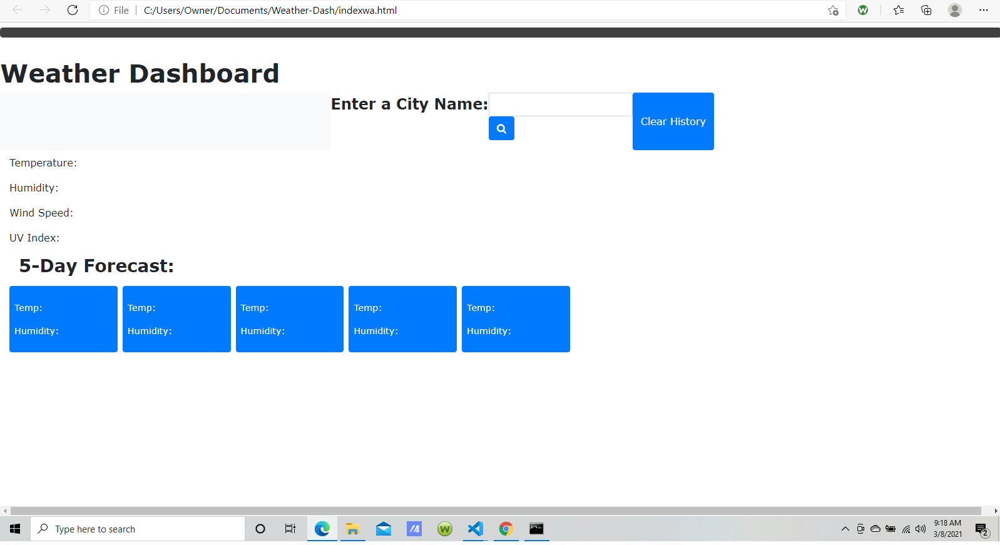

# Weather-Dash

Purpose
The purpose of this project was to create a working weather 
dashboard that allows the user to search for the weather 
of different cities.

Tasks Completed
I created the dashboard using html and css and attempted
to get it work using javascript.

Closing
The weather dashboard was a challenging activity and frankly,
just a bit beyond my capabilites at this point. Buit I tried 
my best and look forward to perfecting it in the future. 

It can be found here

<a href = "//rgivens21.github.io/Weather-Dash/">

